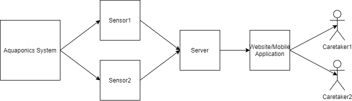

# Aquaponics Automation

## Project Abstract
Use sensors to gather data on Temples Aquaponics systems then send that data to a website or mobile application to help monitor the systems. Aquaponics systems need to be monitored heavily to make sure planets can grow optimally and the systems continues to run smoothly. This can take significant human effort. Water levels, water temperature, ph levels, humidity levels and feeding the fish living in the water tank all need to be monitored and adjusted to keep the system running optimally. Placing various sensors throughout the system and giving the caretakers access to this data through a website or mobile application could increase the efficiency of the system and lower the level of human effort required for the systems upkeep.

Format: 

## Project Relevance
This project meets all four goals for this class. Installing sensors might not be the most difficult task but building the website or mobile application to share this information would take a great amount of work. The team would have to use UML diagrams to map out how the whole system would work. We would have to build the system which would require version control, testing, and the ability to track issues which are bound to arise. Since we would be building the system from scratch, I believe this project would force use to use all the concepts we have learned in class thus far.

## Conceptual Design
Sensors would be placed in the aquaponics systems water tank. The data from these sensors would need to be saved on a computer or, perhaps, a raspberry pie. From hear the data can be processed and sent to a website or mobile application to the users. I believe most of the sensor’s use python code and the team would have to be able to extract that data successfully. Once the team has access to that data needed it could be sent live to a website or mobile application. This would mean creating a website and connecting it to the computer attached to the sensors. Optionally alarms could be sent when certain sensors hit certain levels informing the users action is needed. Another step could be taken to install certain apparatus to automate certain tasks, such as adding water or food to a tank or turning on a heater.

## Background
https://github.com/scottrpaterson/HydroBot-web-app

***Building***

**Running**

## Required Resources
•	Various sensors
•	Computer/raspberry pie
•	Python
•	Html
•	JavaScript
•	Java 
